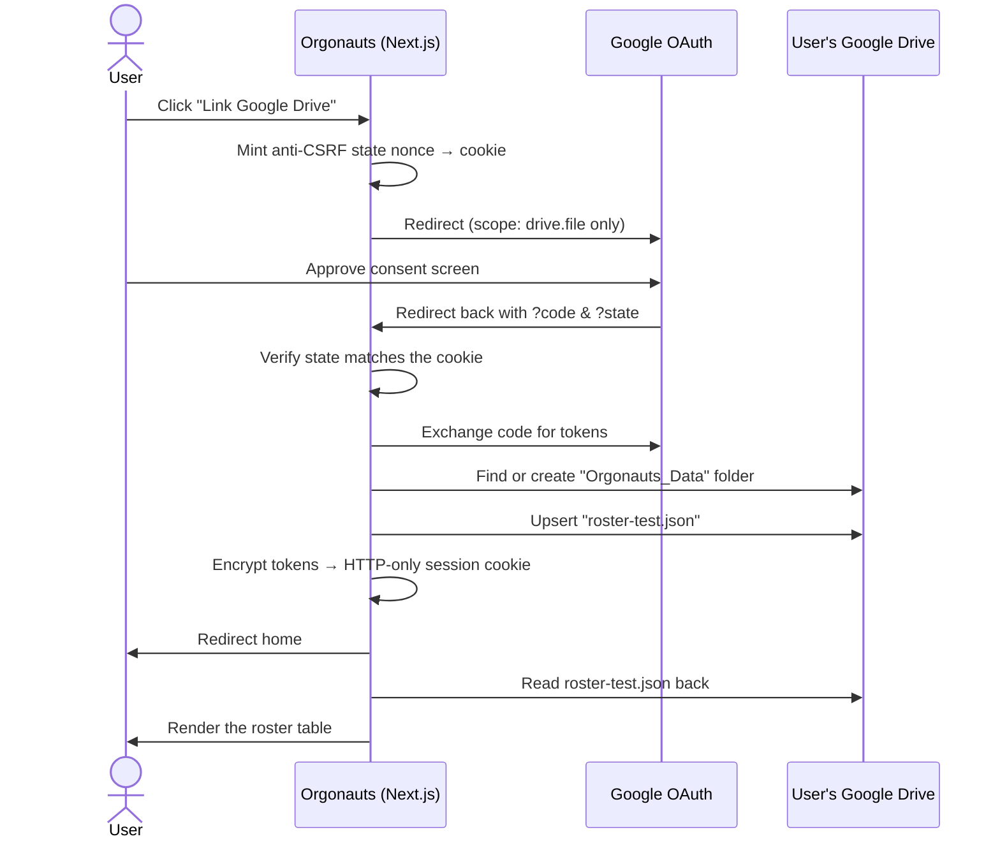

# Orgonauts — BYOC Prototype

**A working prototype of a Bring Your Own Cloud platform.** Your data never
lives in our database, because we don't have one. It lives in *your* Google
Drive, and Orgonauts reads and writes it there.

This repo proves the full loop end to end: link a Google account, provision a
folder in the user's Drive, write a JSON document into it, read it back, render
it, and disconnect cleanly.

Built with **Next.js 16 (App Router)**, **TypeScript**, **Tailwind CSS v4**, and
the official **`googleapis`** client. No NextAuth.

---

## Documentation

| | Document | Read this if you want to… |
| :-- | :-- | :-- |
| 🏛️ | **[Architecture →](docs/ARCHITECTURE.md)** | Understand the Control Plane / Data Plane split, the design decisions, and the roadmap to a hosted database. |
| 🤖 | **[AI Agent Rules →](docs/AI_SETUP.md)** | Point Cursor, Claude, or any other AI at this repo without it breaking the security model. **Read this before letting an agent edit anything.** |
| ⚙️ | **[Environment template →](.env.example)** | Copy to `.env.local` and fill in your credentials. |

---

## What is BYOC?

In a normal SaaS product, the vendor holds your data:

```
You  ──▶  Vendor's app  ──▶  Vendor's database  ◀── vendor owns your data
```

In Bring Your Own Cloud, the vendor holds only the *logic*:

```
You  ──▶  Orgonauts app  ──▶  YOUR Google Drive  ◀── you own your data
```

Orgonauts never stores your records. It orchestrates; you own the bytes. If you
disconnect, your data simply stays where it already was — in your Drive — and we
lose the ability to reach it.

Why this matters commercially, and what it costs us technically, is
[ADR-001 in the architecture doc](docs/ARCHITECTURE.md#adr-001--bring-your-own-cloud-over-a-managed-multi-tenant-database).

---

## What the prototype does



Then **Disconnect Drive** deletes the session cookie, and the app forgets
everything. The folder and file remain in the user's Drive.

---

## Quick start

### 1. Prerequisites

- Node.js 20 or newer
- A Google account
- A Google Cloud project (free)

### 2. Install

```bash
npm install
```

### 3. Configure Google Cloud

1. Open the [Google Cloud Console](https://console.cloud.google.com/) and create
   a project.
2. Enable the **Google Drive API** for that project.
3. Configure the **OAuth consent screen**. While the app is in *Testing* mode,
   add your own Google account under **Test users** — otherwise Google refuses
   consent with `access_denied`.
4. Create an **OAuth client ID** of type *Web application*.
5. Add this exact **Authorized redirect URI**:

   ```
   http://localhost:3000/api/auth/callback/google
   ```

   Google compares this byte for byte. A trailing slash will break it.

### 4. Configure the environment

```bash
cp .env.example .env.local
```

Then fill in `.env.local`:

| Variable | What it is | How to get it |
| :-- | :-- | :-- |
| `GOOGLE_CLIENT_ID` | OAuth client identifier | Google Cloud Console → Credentials |
| `GOOGLE_CLIENT_SECRET` | OAuth client secret | Same screen as above |
| `GOOGLE_REDIRECT_URI` | Where Google sends users back | Must match the Authorized redirect URI exactly |
| `TOKEN_ENCRYPTION_KEY` | AES-256 key protecting tokens in the session cookie | Generate it (below) |

Generate the encryption key:

```bash
node -e "console.log(require('node:crypto').randomBytes(32).toString('base64'))"
```

All four are server-side only — none carry the `NEXT_PUBLIC_` prefix, so none
reach the browser. `.env.local` is git-ignored; never commit real credentials.

### 5. Run

```bash
npm run dev
```

Open <http://localhost:3000> and click **Link Google Drive**.

---

## Verifying it works

After linking, you should see a roster table on the dashboard and an
`Orgonauts_Data` folder containing `roster-test.json` in your Google Drive.

The interesting part is that the failure states are designed too. Try breaking
it on purpose:

| Do this | Expected result |
| :-- | :-- |
| Delete the `Orgonauts_Data` folder in Drive, reload | Amber "Folder not found" with a re-provision button |
| Delete only `roster-test.json`, reload | Amber "Roster document not found" |
| Edit `roster-test.json` in Drive to invalid JSON, reload | Amber "Roster document is unreadable" |
| Revoke access at [Google account permissions](https://myaccount.google.com/permissions), reload | Amber "Google access has expired" |
| Click **Disconnect Drive** | Grey confirmation; folder still in your Drive |
| Change `TOKEN_ENCRYPTION_KEY` and reload | Silently treated as logged out — no crash |
| Click **Link Google Drive** twice | Same folder ID reused, document overwritten, no duplicates |

Checks you can run locally:

```bash
npm run lint        # ESLint
npx tsc --noEmit    # Type check
npm run build       # Production build (also type-checks)
```

---

## Project structure

```
src/
├── app/
│   ├── page.tsx                              Dashboard UI (Server Component)
│   ├── layout.tsx                            Root layout, fonts, metadata
│   └── api/auth/
│       ├── google/route.ts                   Step 1 — redirect to Google
│       ├── callback/google/route.ts          Step 2 — verify, provision, persist
│       └── disconnect/route.ts               The off switch
├── components/
│   ├── Banner.tsx                            Status messages (4 variants)
│   └── RosterTable.tsx                       Renders roster records
└── lib/
    ├── googleDrive.ts                        ALL Google Drive I/O lives here
    ├── session.ts                            Encrypted cookie ↔ DriveSession
    ├── encryption.ts                         AES-256-GCM helpers
    ├── dashboard.ts                          Resolves the page's view state
    └── oauth.ts                              Shared flow vocabulary, error copy
```

The one rule worth internalising: **`src/lib/googleDrive.ts` is the only file
that imports `googleapis`.** Everything above it deals in plain typed data. That
single seam is what makes the future database swap tractable — see
[ADR-003](docs/ARCHITECTURE.md#adr-003--v1-as-a-json-document-store-with-a-deliberate-migration-path).

---

## Troubleshooting

| Symptom | Cause | Fix |
| :-- | :-- | :-- |
| `redirect_uri_mismatch` from Google | `GOOGLE_REDIRECT_URI` differs from the console | Make both exactly `http://localhost:3000/api/auth/callback/google` |
| Banner: "Google OAuth is not configured" | A `GOOGLE_*` variable is missing | Check `.env.local`, restart `npm run dev` |
| Banner: "could not encrypt the session" | `TOKEN_ENCRYPTION_KEY` missing or not 32 bytes | Regenerate with the command above |
| Consent screen says the app is blocked | Your account isn't a Test user | Add it under OAuth consent screen → Test users |
| Banner: "security check on the callback failed" | `state` cookie expired (10 min) or was cleared | Start again from the dashboard |
| Logged out after every restart | `TOKEN_ENCRYPTION_KEY` is changing | Set a fixed value in `.env.local` |

Server logs are prefixed `[orgonauts]` — watch the `npm run dev` terminal.

---

## Security summary

- **Minimum scope.** Only `drive.file`, which Google enforces as "files this app
  created". We *cannot* read the user's other documents, even by accident.
- **Tokens encrypted at rest.** AES-256-GCM inside an HTTP-only, `SameSite=Lax`
  cookie. Tampering fails the authentication tag and is treated as logged out.
- **CSRF protection on login.** A `state` nonce is round-tripped through Google
  and compared against an HTTP-only cookie.
- **No token ever reaches the browser as readable data**, and no secret is
  exposed to client-side JavaScript.
- **Per-request OAuth clients.** No shared mutable client that could leak one
  user's credentials into another user's request.
- **A real off switch.** `POST /api/auth/disconnect` destroys the only copy of
  the credentials we hold.

Full reasoning in [docs/ARCHITECTURE.md](docs/ARCHITECTURE.md#security-model).

---

## Known gaps

This is a prototype. These are deliberate, and each is discussed in the
[architecture doc](docs/ARCHITECTURE.md#known-gaps-and-roadmap):

- The session cookie stands in for a hosted user account — there is no user
  model, no multi-device support, and no server-side revocation.
- Refreshed access tokens are not written back to the cookie during page render
  (Next.js cannot set cookies while rendering), so refresh happens per request.
- Writes are last-write-wins; there is no concurrency control.
- No automated tests yet.
