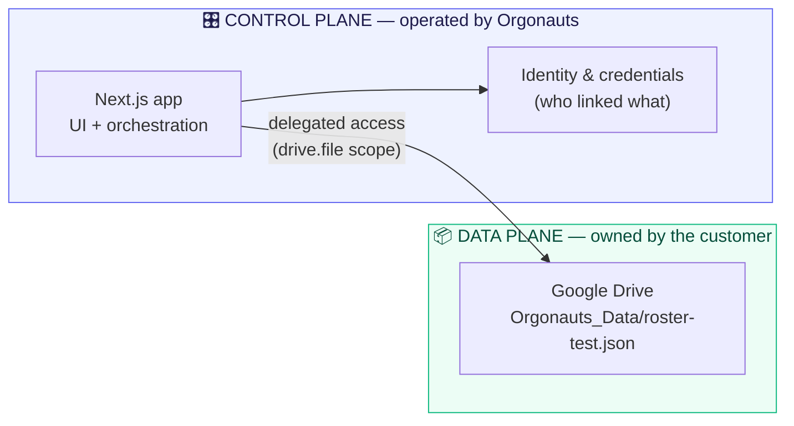
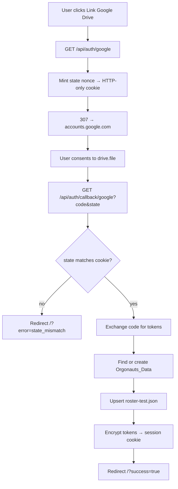
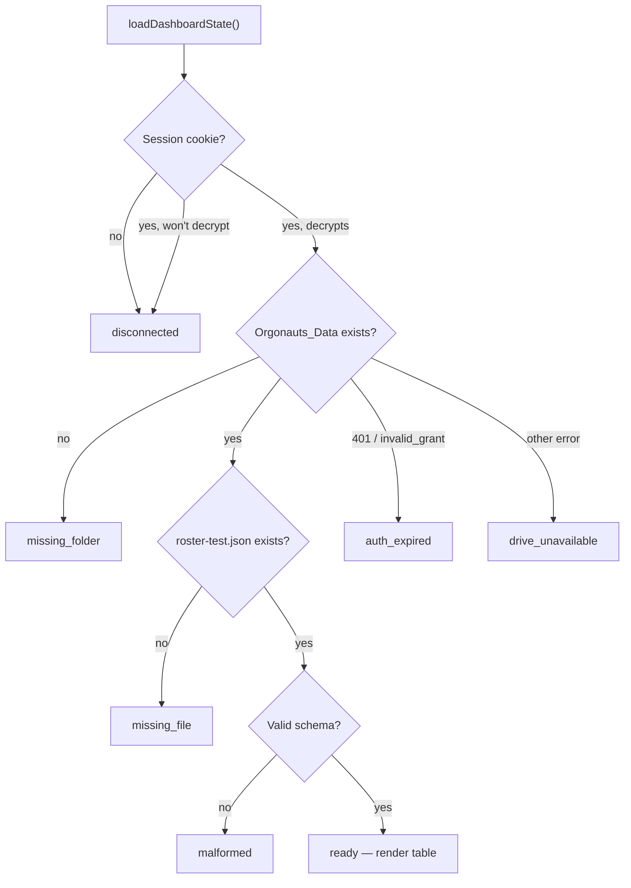

# Architecture

[← Back to README](../README.md) · [AI Agent Rules →](AI_SETUP.md)

This document explains how Orgonauts is put together, why it is put together
that way, and what changes when the prototype becomes a product.

---

## The one idea: Control Plane vs Data Plane

Everything else follows from this split.

- **Control Plane** — the part Orgonauts operates. Who you are, which clouds
  you've linked, what your credentials are, what the app should do next. Small,
  boring, low-risk metadata.
- **Data Plane** — the part *the customer* owns. The actual records. Orgonauts
  reaches into it with delegated permission and never keeps a copy.



A useful test for which plane something belongs to: **if a customer deleted
their Orgonauts account tomorrow, should this data survive?** If yes, it's data
plane and belongs in their cloud. If no, it's control plane and it's ours.

### Where the prototype sits today

The control plane exists — it is just very small, and it lives in a cookie.

| Concern | Production target | **Prototype today** |
| :-- | :-- | :-- |
| Who the user is | `users` row in a hosted Postgres | *Implicit* — one browser, one link |
| Which cloud is linked | `connections` row | Encrypted `orgonauts_drive_session` cookie |
| OAuth tokens | Encrypted column, KMS-managed key | Same cookie, AES-256-GCM, key in env |
| Session | Session table / JWT | The same cookie |
| The records themselves | **Customer's Drive** | **Customer's Drive** ← unchanged |

Note the last row. **The data plane is already final.** Only the control plane
is a stand-in, and that is deliberate: the risky, novel, hard-to-change half of
the architecture is the half we built for real.

### Why a cookie stands in for the hosted database

A prototype has to fake persistence *somewhere*. A cookie was chosen over a
local database file, an in-memory map, or a real hosted DB because:

1. **It models the right shape.** `DriveSession` in
   [`src/lib/session.ts`](../src/lib/session.ts) has the exact fields the future
   `connections` table needs — access token, refresh token, expiry, granted
   scope, linked-at timestamp. The migration is a change of *storage*, not of
   *model*.
2. **It forces the encryption question immediately.** Cookies live on the
   user's machine, so tokens had to be encrypted at rest from day one. A
   `Map` in server memory would have let us postpone that and "add security
   later" — which is how it never gets added.
3. **It keeps the prototype genuinely stateless.** Any developer can clone,
   `npm install`, and run. There is no migration to apply, no container to
   start, no shared dev database to corrupt.
4. **It makes the off switch honest.** Because the cookie is the *only* copy of
   the credentials, `POST /api/auth/disconnect` deleting it really does mean
   Orgonauts can no longer reach the user's Drive. That is exactly the promise
   the real product must keep, tested here for free.

The cookie's honest limitations — one browser only, no server-side revocation,
no audit trail, ~4 KB ceiling — are precisely the list of things a hosted
control-plane database exists to solve. See
[Known gaps and roadmap](#known-gaps-and-roadmap).

---

## Request lifecycles

### Linking a Drive



Three details that are easy to get wrong and are load-bearing here:

- `access_type: "offline"` plus `prompt: "consent"` is what guarantees a refresh
  token. Google omits the refresh token on repeat consent unless forced, and a
  link that dies silently after one hour is a miserable bug to diagnose.
- The `state` cookie must be `SameSite=Lax`, not `Strict`. Google returns the
  user via a cross-origin top-level navigation, and `Strict` would withhold the
  cookie on exactly that request — breaking every single callback.
- The redirect is issued *outside* the `try` block. `redirect()` works by
  throwing, so mixing it into error handling makes real failures indistinguishable
  from successful redirects.

### Rendering the dashboard

`page.tsx` performs no I/O. It calls
[`loadDashboardState()`](../src/lib/dashboard.ts) and switches on the result:



`DashboardState` is a discriminated union, so the `switch` in `page.tsx` is
exhaustive: adding a state without rendering it is a **compile error**, not a
blank panel in production.

Why so many states? Under BYOC the customer can reach into the data plane and
change things behind our back — delete the folder, hand-edit the JSON, revoke
the grant from their Google settings. In a conventional app those are
impossible. Here they are Tuesday. Each needs a distinct message because each
has a distinct fix.

### Disconnecting

`POST /api/auth/disconnect` deletes the session cookie and 303s home. It is
`POST` rather than `GET` because link prefetchers, crawlers, and antivirus
scanners follow `GET` URLs — a `GET` off switch logs people out at random.

---

## Security model

| Threat | Mitigation | Where |
| :-- | :-- | :-- |
| App reads the user's unrelated files | `drive.file` scope only — enforced by Google, not by our code | [`googleDrive.ts`](../src/lib/googleDrive.ts) |
| XSS steals tokens | `httpOnly` cookie; tokens never enter the DOM or client JS | [`session.ts`](../src/lib/session.ts) |
| Attacker reads the cookie off disk | AES-256-GCM encryption at rest | [`encryption.ts`](../src/lib/encryption.ts) |
| Attacker forges a cookie | GCM authentication tag; tampering fails closed to "logged out" | [`encryption.ts`](../src/lib/encryption.ts) |
| Login CSRF (attacker binds their Drive to your session) | `state` nonce verified against an HTTP-only cookie | [`oauth.ts`](../src/lib/oauth.ts) |
| Cross-tenant token leakage | OAuth clients constructed per request, never shared | [`googleDrive.ts`](../src/lib/googleDrive.ts) |
| Malicious file content | Every document validated on read; invalid input renders a message, not a crash | `parseRosterDocument()` |
| Secrets leaking to the client | No `NEXT_PUBLIC_` variables; both crypto and Drive modules are Node-only | — |

Two gaps we accept for now, with eyes open:

- **No CSRF token on disconnect.** A forged cross-site POST could log a user
  out. Annoying, grants the attacker nothing. Needs fixing before the same form
  pattern carries anything destructive.
- **Encryption key lives in an env var.** Fine for local development; production
  wants a KMS-managed key with rotation.

---

## Architecture Decision Records

### ADR-001 — Bring Your Own Cloud over a managed multi-tenant database

**Status:** Accepted for V1.

**Context.** Orgonauts handles organisational data — rosters, membership,
internal records. Our target customers are exactly the organisations with the
strictest opinions about where that data physically lives: schools, non-profits,
regulated teams, anyone with a data-residency or procurement policy. The
conventional answer is a multi-tenant database we operate, which makes Orgonauts
the custodian of everyone's data.

**Decision.** The customer's own cloud account is the system of record.
Orgonauts holds credentials and orchestration logic; the customer holds the
bytes.

**Consequences.**

- *Trust and sales.* "Your data never leaves your Drive" removes the security
  review from the critical path of a deal. There is no shared datastore to
  breach, so compromising Orgonauts does not expose customer records in bulk.
- *Compliance.* Residency, retention, and deletion become properties of an
  account the customer already governs. Offboarding is them revoking a token.
- *Cost.* Storage scales with the customer's account, not our infrastructure
  bill. Marginal per-tenant storage cost is effectively zero.
- *The price we pay.* No cross-tenant queries, no server-side joins, no
  transactions. We inherit the customer's uptime and rate limits. And we must
  treat every read as untrusted input, because the customer can edit the files
  by hand. ADR-003 is designed around these constraints.

### ADR-002 — Request only the `drive.file` scope

**Status:** Accepted. Non-negotiable without a security review.

**Context.** Google Drive offers several scopes. `drive` grants full read/write
over the entire Drive; `drive.readonly` grants read over everything;
`drive.file` grants access **only to files the app itself created**.

**Decision.** Orgonauts requests `https://www.googleapis.com/auth/drive.file`
and nothing else.

**Rationale.**

- *Least privilege as a hard boundary.* We cannot read the customer's existing
  documents even if we wanted to, even with a bug, even if our credentials leak.
  The limit is enforced by Google, not by our discipline.
- *Consent conversion.* `drive` and `drive.readonly` are *restricted* scopes:
  the user sees a stern warning and adoption drops. `drive.file` shows a narrow,
  comprehensible prompt.
- *Verification cost.* Restricted scopes require Google's OAuth verification
  including a third-party security assessment — a five-figure annual expense and
  a multi-week delay before the app can leave testing mode. `drive.file` avoids
  that gate entirely.
- *Blast radius.* A compromised token reaches only Orgonauts-created files.

**Consequences.** We can never ask the user to "pick an existing folder" via a
raw API call; adopting a pre-existing folder requires the Google Picker, which
grants per-file access under the same scope. `files.list` returns only our own
files — which is precisely why folder lookup can be used for idempotency without
enumerating anyone's private documents.

### ADR-003 — V1 as a JSON document store, with a deliberate migration path

**Status:** Accepted for V1.

**Context.** Google Drive is a file store, not a database. We need application
state in it today without painting ourselves into a corner when scale or query
complexity demands a real engine.

**Decision.** Each resource is a single JSON document inside `Orgonauts_Data`,
wrapped in a versioned envelope:

```jsonc
{
  "schemaVersion": 1,
  "resource": "roster",
  "generatedAt": "2026-01-01T00:00:00.000Z",
  "records": [
    { "id": "usr_01", "fullName": "Ada Lovelace", "role": "owner" }
  ]
}
```

**Why this paves the way for SQLite or a cloud database.**

1. **A single storage seam.** Every Drive call lives in `src/lib/googleDrive.ts`,
   and every function takes plain data in and returns plain data out. Routes and
   components never import `googleapis`. Swapping the backing store means
   reimplementing a handful of functions — nothing above the seam changes.
2. **The record shape is already relational.** `RosterMember` is a flat, typed
   row with a primary key. `records` is a table in waiting: the migration is
   `INSERT INTO roster SELECT ... FROM json_each(?)`, not a redesign.
3. **`schemaVersion` makes migration mechanical.** A reader dispatches on the
   version without inspecting the payload, so V1 documents stay readable by a V2
   importer and rollback remains possible.
4. **JSON is the natural intermediate format.** SQLite's `json_each`, Postgres'
   `jsonb`, and every document store ingest this shape directly. If a customer
   keeps BYOC, the same documents can back a SQLite file *stored in their
   Drive* — real queries without giving up the ADR-001 promise.

**Consequences.** No concurrent-write story: two simultaneous writers
last-write-wins over a whole document. Documents must stay small enough to
rewrite whole. Both are fine at prototype scale and both are resolved by the
migration this ADR sets up.

### ADR-004 — An encrypted cookie as the interim control plane

**Status:** Accepted for the prototype. **Explicitly temporary.**

**Context.** Reading data back requires remembering the user's tokens between
requests. The real answer is a hosted database; standing one up would have
delayed the read-path proof and added infrastructure to every developer's
machine.

**Decision.** Persist the tokens in an AES-256-GCM encrypted, HTTP-only,
`SameSite=Lax` cookie, shaped as the future database row.

**Rationale.** Covered in [Why a cookie stands in for the hosted
database](#why-a-cookie-stands-in-for-the-hosted-database).

**Consequences.** Sessions are per-browser and cannot be revoked server-side.
Key rotation logs everyone out — handled gracefully (decryption failure is
treated as "disconnected", never as an error). The ~4 KB cookie limit caps what
we can store, which is why `DriveSession` stores five named fields rather than
Google's raw credential blob.

---

## Known gaps and roadmap

Ordered roughly by the sequence we should tackle them.

| # | Gap | Why it matters | Resolution |
| :-- | :-- | :-- | :-- |
| 1 | No user model | Can't support multi-device, teams, or server-side revocation | Hosted control-plane DB with `users` + `connections` tables |
| 2 | Refreshed tokens aren't persisted | A refreshed access token is discarded after each render, so we refresh more often than necessary | Move refresh into a Route Handler or Server Action, which *can* set cookies |
| 3 | No CSRF token on disconnect | Forged POST can log a user out | Signed per-session form token |
| 4 | Encryption key in an env var | No rotation story | KMS / secret manager with versioned keys |
| 5 | Last-write-wins on documents | Concurrent edits silently clobber | Drive revision IDs as optimistic-concurrency tokens |
| 6 | No automated tests | Refactors rely on manual checking | Unit-test the pure functions first: `parseRosterDocument`, `encryptToString`/`decryptToString`, `loadDashboardState` with a faked Drive |
| 7 | Single provider | BYOC implies choice | Extract a `StorageAdapter` interface from `googleDrive.ts`; add Dropbox / S3 / OneDrive behind it |

### What the migration to a hosted control plane actually looks like

Concretely, when gap #1 is addressed:

1. Add the database and a `connections` table mirroring the `DriveSession`
   fields (they were chosen for this).
2. Change `readDriveSession()` to look up by user ID instead of decrypting a
   cookie. **Its signature and return type stay the same.**
3. Reduce the cookie to a session identifier.
4. Everything else — `dashboard.ts`, `googleDrive.ts`, every component — is
   untouched.

That is the whole point of the seams. If a change to the control plane requires
editing `googleDrive.ts` or a component, the layering has been violated
somewhere and that is worth a conversation in review.

---

[← Back to README](../README.md) · [AI Agent Rules →](AI_SETUP.md)
